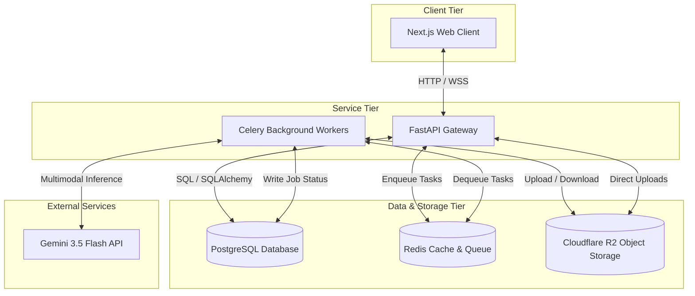

# System Architecture Design

This document details the architecture, design patterns, and processing pipelines of the standalone AI-powered media processing application.

---

## High-Level Separation of Concerns

The application uses a distributed, decoupled service model to handle high-frequency user interactions and resource-intensive media/AI workloads independently.

### 1. Next.js Frontend (Presentation Layer)
*   **Role**: Serves the user interface, manages client-side state, handles file uploads, and renders media processing dashboards.
*   **Key Design Decisions**:
    *   Uses **React Server Components (RSC)** for fast initial loads and SEO efficiency.
    *   Employs **Tailwind CSS** for styling, adhering to a strict dark-mode-first aesthetic.
    *   Implements **direct client-to-R2 presigned URLs** to bypass the backend for heavy file uploads, saving backend bandwidth.
    *   Establishes **WebSocket connections** (or fallback Server-Sent Events/polling) to receive real-time job completion notices from the backend.

### 2. FastAPI Backend (Orchestration & Gateway Layer)
*   **Role**: Exposes secure REST endpoints, manages relational schema and authentication, generates presigned storage URLs, and coordinates task scheduling.
*   **Key Design Decisions**:
    *   **Asynchronous Event Loop**: Utilizing Python's `asyncio` to handle high-concurrency requests with minimal resource overhead.
    *   **Pydantic Integration**: Enforces strict payload validation and automatic OpenAPI generation.
    *   **Stateless Gatekeeping**: Does not store session state or perform CPU-intensive tasks directly in the API process, ensuring high throughput.

### 3. Background Workers (Compute Layer)
*   **Role**: Asynchronously executes heavy image manipulation, background removal models, and coordinates with external LLMs.
*   **Key Design Decisions**:
    *   Powered by **Celery** with **Redis** as a broker, allowing scale-out capability to multiple worker nodes.
    *   Isolated environment: Workers run on GPU/CPU-optimized nodes containing ML dependencies (e.g., PyTorch, OpenCV, ONNX Runtime).
    *   **Fault Tolerance**: Implements task retries with exponential backoff for external API connections.

### 4. Data & Storage Tier
*   **PostgreSQL**: Stores persistent relational schema including users, workspace states, task run-logs, billing, and system configurations.
*   **Cloudflare R2**: Zero-egress fee object storage configured with S3 compatibility. Prevents storage cost spikes when transfer volumes are high.
*   **Redis**: Serves both as the high-speed cache for API state and the broker/backend for the Celery worker queue.

---

## Media Processing Pipeline

Heavy file manipulation (such as background removal) is processed using an asynchronous queue pattern to guarantee system stability under load.

### Processing Sequence Diagram

```mermaid
sequenceDiagram
    autonumber
    actor Client as Next.js Client
    participant API as FastAPI Backend
    participant DB as PostgreSQL
    participant Queue as Redis Queue
    participant Worker as Celery Worker
    participant R2 as Cloudflare R2
    participant Gemini as Gemini API

    Client->>API: POST /api/media/process (Request Presigned Upload)
    API-->>Client: Return R2 Presigned Upload URL & Job ID
    Client->>R2: PUT /media/uploads/{id} (Binary Image Data)
    R2-->>Client: 200 OK (Uploaded)

    Client->>API: POST /api/jobs/{id}/start (Trigger Job Execution)
    API->>DB: INSERT INTO jobs (id, status, input_url) VALUES (id, 'PENDING', input_url)
    API->>Queue: Enqueue task (job_id, input_url)
    API-->>Client: 202 Accepted (Job Enqueued)

    Worker->>Queue: Fetch Task
    Worker->>DB: UPDATE jobs SET status = 'PROCESSING' WHERE id = job_id
    Worker->>R2: GET /media/uploads/{id} (Retrieve original image)
    R2-->>Worker: Image Binary data

    Worker->>Gemini: POST Vision request (Analyze subject, boundary coords)
    Gemini-->>Worker: Return JSON metadata & segmentation guidance

    rect rgb(30, 41, 59)
        note over Worker: Run Background Removal Model (e.g., U^2-Net / ONNX)
        Worker->>Worker: Apply Alpha Matte & crop to subject bounds
    end

    Worker->>R2: PUT /media/processed/{id} (Upload final transparent PNG)
    R2-->>Worker: 200 OK (Stored)

    Worker->>DB: UPDATE jobs SET status = 'COMPLETED', output_url = final_url, metadata = json_data WHERE id = job_id
    Worker-->>API: Emit event (Job Complete)
    API-->>Client: Push WebSocket Event (Job Complete)

    Client->>R2: GET /media/processed/{id} (Render processed image)
    R2-->>Client: Display Image
```

---

## Separation of Concerns & Security

1.  **Direct-to-Storage Uploads**: Clients write binary data directly to Cloudflare R2 using short-lived, cryptographically signed HTTP PUT URLs. This keeps the FastAPI backend free of file-stream buffer handling, enhancing API scalability.
2.  **Resource Isolation**: Background workers run in distinct process environments (or container classes). If an image processing task runs out of memory (OOM), only the isolated worker is restarted, ensuring the API gateway remains completely responsive.
3.  **Strict Typing**: Every database model (SQLAlchemy) translates to an API response schema (Pydantic), which maps directly to TypeScript interfaces (`types.ts`) in the Next.js frontend, ensuring compile-time type safety across the entire stack.
