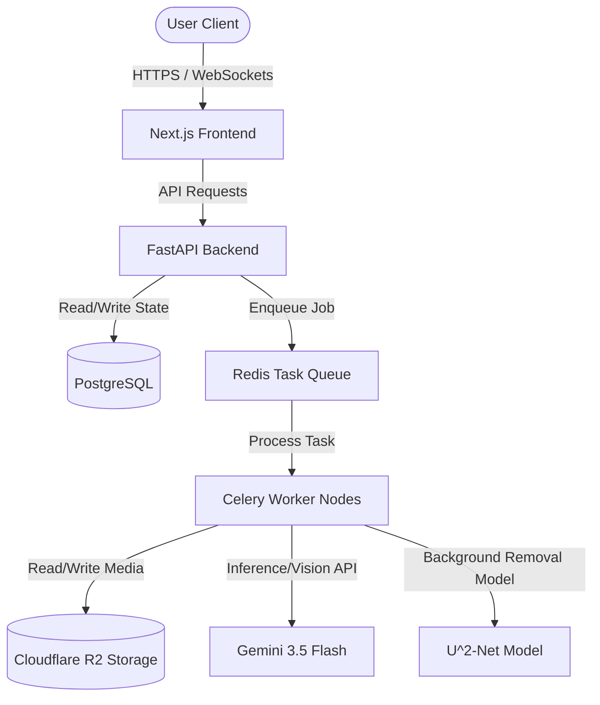

# AI-Powered Workflow & Media Processing Application

A production-grade, standalone media processing and AI-driven workflow automation platform. This application integrates a high-performance Next.js frontend with a robust FastAPI python microservice backend to orchestrate complex AI agent tasks and handle heavy media manipulation workflows (such as image background removal) asynchronously.

---

## Architecture Overview

The system is designed with a strict separation of concerns, decoupling user interaction, API routing, state management, and long-running GPU/CPU-intensive workloads:

*   **Frontend**: Next.js (App Router, TypeScript, Tailwind CSS) providing a responsive, interactive dashboard and real-time task status tracking.
*   **Backend API**: FastAPI (Python 3.12) serving as the orchestration layer, handling authentication, metadata, and task dispatching.
*   **Database**: PostgreSQL for persistent application state, user configurations, and agent execution logs.
*   **Object Storage**: Cloudflare R2 for high-throughput, zero-egress fee media asset storage.
*   **Background Workers**: Redis and Celery (or FastAPI Background Tasks) executing asynchronous jobs (e.g., U^2-Net background removal, LLM synthesis).
*   **AI Engine**: Gemini 3.5 Flash for multi-modal analysis, visual metadata tagging, and workflow synthesis.



---

## Key Features

*   **AI Agent Orchestration**: Multi-agent system featuring specialized agents (`OrchestratorAgent`, `VisionProcessorAgent`, `DataSynthesizerAgent`) executing stateless, decoupled workflows.
*   **Asynchronous Media Processing**: Heavy computation workloads (such as background removal and image optimization) are offloaded to background workers to prevent blocking the HTTP event loop.
*   **Multimodal Analysis**: Seamless integration with Gemini 3.5 Flash for vision understanding, metadata tagging, and parsing structured JSON outputs.
*   **Zero-Egress Asset Pipeline**: High-performance media delivery and storage optimized with Cloudflare R2.
*   **Real-time Task Tracking**: Live execution progress updates delivered via WebSocket connections or polling architectures.

---

## Prerequisites

Ensure your development environment meets the following specifications:

*   **Operating System**: Linux (Ubuntu 22.04 LTS or newer) or Windows Subsystem for Linux 2 (WSL2) with Ubuntu distribution.
*   **Runtime Environments**:
    *   **Node.js**: v20.x or higher (LTS recommended)
    *   **Python**: v3.12.x
*   **Databases & Services**:
    *   **PostgreSQL**: v15 or higher
    *   **Redis**: v7.x (required for task queueing and caching)
*   **Storage & API Access**:
    *   Cloudflare R2 Bucket credentials (S3-compatible API access)
    *   Google Gemini API Key

---

## Quickstart

Follow these steps to initialize and run the application locally. For comprehensive instructions, refer to [SETUP.md](file:///home/eisen/remove-background/SETUP.md).

### 1. Clone & Setup Directories
Ensure you are in the application root directory.

```bash
git clone <repository-url> remove-background
cd remove-background
```

### 2. Configure Environment Variables
Create the necessary environment files in the frontend and backend directories:

```bash
# In backend/
cp .env.example .env

# In frontend/
cp .env.example .env.local
```

### 3. Initialize the Backend
Set up a Python virtual environment, install dependencies, and run migrations:

```bash
cd backend
python3.12 -m venv venv
source venv/bin/activate
pip install -r requirements.txt
alembic upgrade head
python -m app.main
```

### 4. Initialize the Frontend
Install Node dependencies and start the Next.js development server:

```bash
cd ../frontend
npm install
npm run dev
```

### 5. Start Background Workers
In a separate terminal window:

```bash
cd backend
source venv/bin/activate
celery -A app.workers.tasks worker --loglevel=info
```
